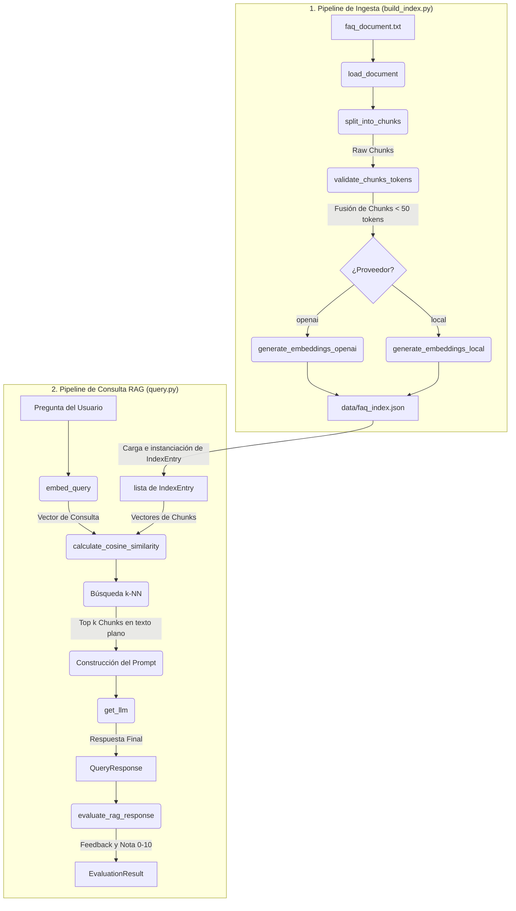

# Chatbot RAG de Soporte para FAQs — TalentoHub

Este proyecto implementa un sistema de **Generación Aumentada por Recuperación (RAG - Retrieval-Augmented Generation)** diseñado para automatizar el soporte al cliente de **TalentoHub**, un SaaS de Recursos Humanos. El chatbot responde preguntas frecuentes sobre políticas internas, procedimientos y beneficios de la empresa de manera autónoma, precisa y auditable, reduciendo la carga de trabajo de los agentes humanos de soporte.

El sistema procesa documentación no estructurada (FAQs), la segmenta en chunks, genera embeddings vectoriales y realiza una búsqueda de similitud coseno explícita para alimentar a un modelo de lenguaje (LLM), el cual genera respuestas fundamentadas en el contexto recuperado. Además, incluye un **Agente Evaluador** que audita la calidad y fidelidad de la respuesta generada.

---

## Características Principales

- **Data Pipeline Modular**: Carga, segmentación inteligente, validación de tokens y almacenamiento.
- **Búsqueda Vectorial Transparente (k-NN)**: Cálculo explícito de similitud coseno utilizando NumPy sin depender de bases de datos externas opacas.
- **Arquitectura Flexible**: Ruteo dinámico que permite combinar modelos en la nube de OpenAI y modelos locales de Hugging Face.
- **Agente Evaluador Integrado**: Calificación automática de las respuestas de 0 a 10 evaluando relevancia, completitud y precisión semántica.
- **Validación con Pydantic**: Tipado estricto en la entrada y salida de datos del pipeline.

---

## Arquitectura del Sistema

El siguiente diagrama ilustra el flujo de datos y la ejecución de funciones del sistema RAG:



---

## Requisitos de Instalación

Sigue estos pasos para instalar y ejecutar el proyecto en tu entorno local:

### Paso 1: Clonar el repositorio
Abre tu terminal y clona el proyecto en tu máquina:
```bash
git clone https://github.com/WillBluetab/CursoIA-Reto2.git
cd CursoIA-Reto2
```

### Paso 2: Crear e instalar el entorno virtual
Se recomienda utilizar Python 3.10 o superior. Crea tu entorno virtual y corre la instalación de dependencias:
```bash
python -m venv .venv
# Activar en Windows (PowerShell)
.venv\Scripts\Activate.ps1
# Activar en Linux/macOS
source .venv/bin/activate

# Instalar dependencias
pip install -r requirements.txt
```

### Paso 3: Configurar las variables de entorno
Crea una copia del archivo `.env.example` con el nombre `.env`:
```bash
cp .env.example .env
```
Abre el archivo `.env` y añade tu clave de API de OpenAI:
```ini
OPENAI_API_KEY=tu_clave_de_openai_aqui
EMBEDDING_PROVIDER=openai # o 'local' para HuggingFace
```

---

## Guía de Uso

El sistema consta de dos etapas obligatorias (Indexación e Interrogación):

### 1. Ejecutar el Pipeline de Ingesta e Indexación
Este script lee el manual de políticas, divide el texto en chunks y genera los embeddings vectoriales:
```bash
python src/build_index.py
```
*Esto generará la base de conocimiento vectorizada en el archivo `data/faq_index.json`.*

### 2. Ejecutar el Pipeline de Consulta
Realiza preguntas directamente por línea de comandos para obtener la respuesta formateada en JSON estructurado y la evaluación de calidad:
```bash
python src/query.py --query "¿Cuántos días de vacaciones tengo al año y cómo las solicito?"
```

---

## Ejemplo de Entrada y Salida

### Comando
```bash
python src/query.py --query "Cuantos dias de vacaciones tengo al ano y como las solicito"
```

### Salida Esperada (JSON)
```json
{
  "user_question": "Cuantos dias de vacaciones tengo al ano y como las solicito",
  "system_answer": "Todos los empleados contratados a tiempo completo en TalentoHub tienen derecho a un total de 30 días naturales de vacaciones remuneradas por cada año completo de servicio activo. Para solicitarlas, debes enviar una solicitud a través del portal de HR en la sección \"Mi Tiempo > Solicitar Ausencia\" con al menos 15 días hábiles de antelación para periodos superiores a 5 días laborables (o 5 días hábiles para periodos más cortos de 1 a 4 días). Todas las solicitudes requieren la aprobación digital de tu mánager directo.",
  "chunks_related": [
    "1.1. Derecho anual y devengo de vacaciones\nTodos los empleados contratados a tiempo completo en TalentoHub tienen derecho a un total de 30 días...",
    "1.2. Procedimiento para la solicitud y aprobación de vacaciones\nPara garantizar la continuidad del negocio y el correcto funcionamiento de cada departamento..."
  ]
}
```

---

## Decisiones Técnicas

### Estrategia de Chunking
Se utilizó `RecursiveCharacterTextSplitter` parametrizado con un tamaño máximo de `800` caracteres y un solapamiento (`overlap`) de `100` caracteres. Esto nos permite conservar la estructura semántica de párrafos completos y oraciones en español. Adicionalmente, se programó un filtro que calcula mediante `tiktoken` los tokens exactos de cada chunk. Si un chunk es inferior a **50 tokens**, en lugar de ser descartado (lo que causaría pérdida de contexto), se **fusiona automáticamente** con el fragmento anterior, garantizando que el 100% de la información sea indexada cumpliendo el límite estricto de la rúbrica (50-500 tokens).

### Búsqueda Vectorial
Para cumplir de forma transparente con el cálculo de similitud explícita, se implementó un algoritmo **k-NN (k-Nearest Neighbors)** que recorre los vectores indexados en el JSON. Se calcula la **similitud coseno** de manera matemática directa mediante funciones de **NumPy** ($A \cdot B / (\|A\| \|B\|)$). Esto hace que el repositorio sea completamente autocontenido, fácil de depurar y libre de dependencias complejas de bases de datos que dificulten la ejecución por parte del calificador.

---

## Beneficios de la Arquitectura RAG frente a Fine-Tuning

1. **Conocimiento Actualizable sin Costo**: Si cambian los límites de dietas o el número de días de vacaciones de la empresa, basta con modificar el archivo de texto plano `faq_document.txt` y volver a ejecutar `build_index.py` (lo cual toma menos de 5 segundos). El fine-tuning requeriría un reentrenamiento costoso y lento.
2. **Atribución de Fuentes y Transparencia**: Al devolver la clave `chunks_related`, el sistema proporciona las fuentes textuales de donde extrajo el conocimiento. Esto hace que las respuestas sean completamente auditables y mitiga las alucinaciones del modelo.
